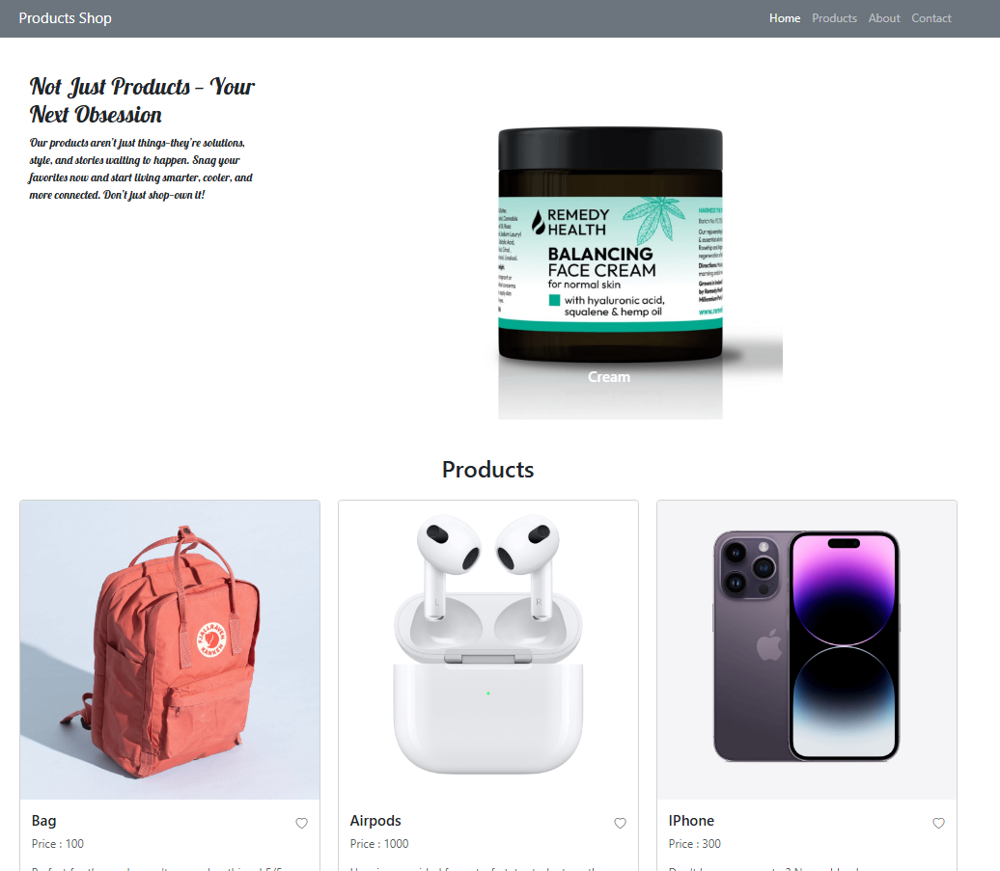

# Product Showcase Page

## Project Overview
This project is a responsive **Product Showcase Page** designed to attractively display a curated list of products. It features a dynamic image carousel and product descriptions, giving users an engaging way to explore items.

## Features
- **Responsive layout:** The page adapts smoothly across devices.
- **Dynamic product carousel:** Automatically cycles through product images every 3 seconds.
- **Product description panel:** A stylish introduction highlights the product collection.
- **Favorite icon:** Users can toggle favorite hearts on products.
- **Clean and modern UI:** Built using Bootstrap 5 for fast and consistent styling.

## Technologies Used
- HTML5 & CSS3
- JavaScript (vanilla)
- [Bootstrap 5](https://getbootstrap.com/)
- Bootstrap Icons

## 📸 Preview
 

## How It Works
- The left panel contains a creative product intro with a catchy title and description.
- The right panel features a Bootstrap carousel showcasing product images and names, changing every 3 seconds.
- Favorite icons allow users to mark items interactively.
- The layout uses a flexbox row to keep the intro and carousel side-by-side with defined widths.

## Getting Started
1. Clone or download this repository.
2. Open `project.html` (or your main HTML file) in a modern browser.
3. Enjoy browsing the products!

## Future Improvements
- Add real “Add to Cart” functionality.
- Add real “Delete from Cart” functionality.
- Add real TO put the product You like to your Favaurites .
- Fetch products from a server or external JSON file.
- Implement filtering and search features.
- Improve accessibility with keyboard navigation.

---

**Made with by [Randa Erfan]**

